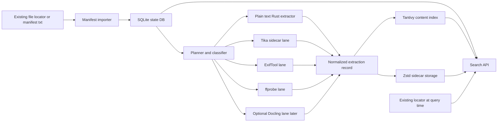

# Very Detailed Rust Implementation Guide
## Building a Fast, Storage-Efficient Content Search System Without Rebuilding the Whole Corpus

Date: 2026-04-09  
Format: Markdown  
Audience: junior Rust programmer  
Scope: first production-grade implementation, designed so it can grow into a larger system later  
Core idea: keep the original files where they already are, and build only compressed searchable derivatives

---

## Executive summary

You already have an important piece: a file-locator tool that can return matching files across roughly 25 million file records in under 500ms by filename, path, extension, size, and similar file-system style filters.

That means your content system should **not** try to replace that tool.

Instead, build a second system that does only the work your locator does **not** do well:

1. extract text and rich metadata from files,
2. deduplicate that extracted representation where possible,
3. store the extracted representation compactly,
4. build a content index over that representation,
5. join the content hits back to the file paths and file metadata.

That architecture gives you three major benefits:

- you do **not** duplicate the raw corpus into one giant database,
- you do **not** duplicate the locator's path/name/extension functionality,
- you can re-run extraction and indexing without touching the source corpus format.

For a junior programmer, the most practical first implementation is:

- **Rust application** for orchestration, state, storage, indexing, and API
- **SQLite** for durable pipeline state and path-to-content mapping
- **Tantivy** for embedded full-text indexing in Rust
- **Zstd-compressed sidecar blobs** for extracted text and rich metadata
- **Apache Tika** as a sidecar for PDF and Office extraction
- **ExifTool** for image metadata
- **ffprobe** for audio/video metadata
- **plain text extraction in Rust** for txt, md, csv, json, html, code, and log files
- **optional Docling lane later** for layout-sensitive PDFs and Office docs

The most important modeling decision is this:

- A **file instance** is one path on disk.
- A **content object** is one unique byte payload.
- A **search document** is the indexed representation of that content.

If the same PDF exists in ten folders, you want ten `file_instance` rows, but ideally only **one** `content_object` and only **one** indexed content representation.

That is how you keep storage growth under control.

---

## What you are building

You are building a **layered content-search platform** with five responsibilities:

1. **Discovery**: get candidate file paths from your existing locator or from a surrogate manifest text file.
2. **Classification**: decide which extractor lane should process each file.
3. **Extraction**: turn each supported file into normalized text and metadata.
4. **Persistence**: save compressed sidecar artifacts instead of copying the original binary file.
5. **Retrieval**: search the extracted text and metadata quickly, then join results back to file paths.

You are **not** building:

- a replacement file system,
- a replacement object store,
- a replacement file-locator database,
- a giant monolithic row-store containing full copies of all binaries,
- a universal semantic vector platform on day 1.

---

## The one architectural decision that matters most

### Replicate representations, not payloads

Do **not** ingest raw PDFs, DOCX files, JPEGs, videos, and everything else into one giant database as full copies unless you have a very specific reason.

Instead, keep the source files where they are, and create only these derivatives:

- normalized text for text-like documents,
- selected metadata for images and media,
- search index structures,
- small previews or snippets,
- optional structured representations for advanced document families.

This is the core storage-saving idea.

### Use your existing locator as the file-discovery authority

Your locator is already good at:

- path search,
- name search,
- extension search,
- size filters,
- fast enumeration by file family.

So let it remain authoritative for that class of queries.

Your content engine should be authoritative for:

- full-text body search,
- extracted metadata search,
- document-title and subject search,
- transcript search,
- OCR text if you add it later,
- content-aware ranking.

---

## Glossary for a junior programmer

Before touching code, make sure these terms are clear.

### Manifest
A file that lists source files to process. In your first version this is just a text file of paths. Later it can be replaced by an API call to your locator.

### File instance
One discovered file path. Example: `/share/legal/contract1.pdf`.

### Content object
One unique file payload. If the same bytes exist at multiple paths, those file instances can point to the same content object.

### Extractor
A component that reads a file and produces normalized text and metadata.

### Sidecar
A separate derived artifact stored next to, but not inside, the original file. Example: a `zstd`-compressed text blob or metadata JSON.

### Search document
The record inserted into the search index. In this guide, the preferred long-term model is one search document per content object, not one per path.

### Chunk
A smaller part of a large document. You do **not** need chunking in the first end-to-end version, but you should design so you can add it later.

### Canonical path
The path you choose to display as the main location for a result when a content object has multiple live file instances.

---

## The architecture you should implement



### Why this architecture is the right one for your case

Because it splits the world into two parts:

- **file-system style search** remains with your locator,
- **content search** lives in a separate optimized pipeline.

That prevents you from rebuilding a second giant database that duplicates the first.

---

## The identity model: do not skip this section

This data model is what keeps the system clean.

### 1. `file_instance`
Represents one path discovered by the locator or the manifest.

Fields you care about:

- path
- optional locator id
- extension
- size
- mtime
- last seen time
- current status
- content id once known

### 2. `content_object`
Represents one unique payload.

Fields you care about:

- strong content hash if available
- family and MIME type
- extracted title
- text length
- language if you add that later
- sidecar blob references
- extractor version

### 3. `search_document`
Represents the searchable derivative.

In the preferred model:

- one `search_document` per `content_object` in version 1,
- later maybe one `search_document` per chunk for large documents.

### Why this model matters

If a file moves to a new path but the bytes stay the same, you update the `file_instance` row, but you **do not** re-extract and **do not** reindex the content object.

That is one of the biggest storage and CPU wins in the whole system.

---

## What to build first and what to postpone

### Build now

- manifest ingestion
- file stat and classification
- plain text extractor
- Tika extractor for PDF and Office docs
- ExifTool extractor for images
- ffprobe extractor for media
- SQLite state tracking
- compressed sidecar storage
- Tantivy content index
- simple Axum HTTP search API
- delete / retry / reprocess logic
- metrics and logs

### Postpone until the base system works

- recursive archive expansion
- OCR on every image and PDF
- Docling for every document
- vector embeddings for the whole corpus
- distributed queues
- distributed search
- custom relevance ML
- packing millions of sidecars into advanced packfiles

A junior programmer can build the first list successfully. The second list is how projects get stuck for months.

---

## Recommended project layout

Start with **one Rust binary crate** and modules. Do not begin with a complicated workspace.

```text
content-search/
  Cargo.toml
  config/
    default.toml
  src/
    main.rs
    cli.rs
    config.rs
    models.rs
    time.rs
    manifest.rs
    state.rs
    planner.rs
    classifier.rs
    hashing.rs
    normalize.rs
    search.rs
    api.rs
    util.rs
    extract/
      mod.rs
      plain_text.rs
      tika.rs
      exiftool.rs
      ffprobe.rs
      docling.rs
    store/
      mod.rs
      blobs.rs
    index/
      mod.rs
      tantivy_index.rs
  migrations/
    0001_init.sql
  scripts/
    run_tika.sh
    sample_manifest.sh
  data/
    state.db
    blobs/
    index/
```

### Why a single crate first

Because the hard part is not dependency boundaries. The hard part is making the pipeline reliable.

Once the end-to-end system works, you can split into crates if the codebase grows large.

---

## Rust dependencies

Use `cargo add` so you do not hard-code versions in the guide. That lets you pin the current stable versions at implementation time.

```bash
cargo add anyhow thiserror clap serde serde_json toml
cargo add tokio --features macros,rt-multi-thread,fs,process,time,sync
cargo add tracing tracing-subscriber uuid chrono async-trait
cargo add rusqlite --features bundled,chrono
cargo add blake3 zstd reqwest axum tower-http infer mime_guess
cargo add tantivy
```

Optional later:

```bash
cargo add rayon
cargo add notify
cargo add metrics metrics-exporter-prometheus
```

### External tools to install

- Java runtime for Apache Tika
- Apache Tika server or app
- ExifTool
- ffprobe from FFmpeg
- optional Python environment for Docling later

Do **not** try to rewrite PDF and Office parsing in Rust just because your main application is in Rust. That is wasted time.

---

## Configuration file example

Create `config/default.toml`.

```toml
[state]
db_path = "data/state.db"

[storage]
blob_root = "data/blobs"
index_root = "data/index/tantivy"
text_codec = "zstd"
text_zstd_level = 5
meta_zstd_level = 5

[workers]
plain_text = 12
tika = 4
exiftool = 8
ffprobe = 8
index = 1
max_open_files = 64

[limits]
max_plain_text_bytes = 67108864
max_full_hash_bytes = 536870912
max_preview_chars = 800
extract_timeout_secs = 60
tika_timeout_secs = 120
ffprobe_timeout_secs = 30
exiftool_timeout_secs = 30

[tika]
enabled = true
base_url = "http://127.0.0.1:9998"

[docling]
enabled = false
base_url = "http://127.0.0.1:8001"

[search]
default_limit = 20
overfetch_factor = 10
```

### Important design note

The worker counts are not magic numbers. They are just safe starting values. Tune them after measuring.

---

## The surrogate manifest format you should support first

Support **two** input formats from day 1:

### V1: one path per line

```text
/share/docs/report1.pdf
/share/docs/report2.docx
/share/media/video1.mp4
```

### V2: JSON Lines for later integration

```json
{"locator_id":"a1","path":"/share/docs/report1.pdf","size_bytes":12345,"mtime_unix_ms":1710000000000}
{"locator_id":"a2","path":"/share/media/video1.mp4","size_bytes":987654321,"mtime_unix_ms":1710000005000}
```

### Why support both

Because your first system uses the plain text file immediately, and later the same code can accept richer records from the locator.

### Rust type for the richer form

```rust
use std::path::PathBuf;
use serde::{Deserialize, Serialize};

#[derive(Debug, Clone, Serialize, Deserialize)]
pub struct ManifestEntry {
    pub locator_id: Option<String>,
    pub path: PathBuf,
    pub size_bytes: Option<u64>,
    pub mtime_unix_ms: Option<i64>,
    pub family_hint: Option<String>,
}
```

### File source abstraction

This abstraction is the trick that lets you swap the text file out later.

```rust
use async_trait::async_trait;

#[async_trait]
pub trait FileSource {
    async fn next_batch(&mut self, max_items: usize) -> anyhow::Result<Vec<ManifestEntry>>;
}
```

Implementations:

- `TextManifestSource`
- `JsonlManifestSource`
- later `LocatorApiSource`

---

## State database design

Use SQLite first. It is good enough for a single-machine pipeline and massively easier than standing up a full external state service before you need one.

### Why SQLite is acceptable here

Because SQLite is not your search engine and not your source-of-truth file database.

It is only used for:

- pipeline state,
- file-instance mapping,
- content-object mapping,
- retries,
- errors,
- join-back of search hits to file paths.

That is a very good fit for SQLite on one machine.

---

## Initial schema

Create `migrations/0001_init.sql`.

```sql
CREATE TABLE IF NOT EXISTS manifest_batches (
    id TEXT PRIMARY KEY,
    source_name TEXT NOT NULL,
    source_kind TEXT NOT NULL,
    family_hint TEXT NULL,
    imported_at INTEGER NOT NULL,
    line_count INTEGER NOT NULL DEFAULT 0
);

CREATE TABLE IF NOT EXISTS file_instances (
    id INTEGER PRIMARY KEY AUTOINCREMENT,
    locator_id TEXT NULL,
    batch_id TEXT NULL,
    path_raw TEXT NOT NULL,
    path_norm TEXT NOT NULL UNIQUE,
    ext TEXT NULL,
    size_bytes INTEGER NULL,
    mtime_unix_ms INTEGER NULL,
    quick_fingerprint TEXT NULL,
    full_blake3 TEXT NULL,
    mime_detected TEXT NULL,
    family TEXT NULL,
    status TEXT NOT NULL DEFAULT 'discovered',
    content_id TEXT NULL,
    attempts INTEGER NOT NULL DEFAULT 0,
    last_error_code TEXT NULL,
    last_error_message TEXT NULL,
    first_seen_at INTEGER NOT NULL,
    last_seen_at INTEGER NOT NULL,
    last_processed_at INTEGER NULL,
    deleted_at INTEGER NULL
);

CREATE INDEX IF NOT EXISTS idx_file_instances_status
    ON file_instances(status);

CREATE INDEX IF NOT EXISTS idx_file_instances_content_id
    ON file_instances(content_id);

CREATE INDEX IF NOT EXISTS idx_file_instances_locator_id
    ON file_instances(locator_id);

CREATE TABLE IF NOT EXISTS content_objects (
    content_id TEXT PRIMARY KEY,
    full_blake3 TEXT NULL UNIQUE,
    size_bytes INTEGER NOT NULL,
    mime_detected TEXT NULL,
    family TEXT NOT NULL,
    has_text INTEGER NOT NULL DEFAULT 0,
    text_chars INTEGER NOT NULL DEFAULT 0,
    language TEXT NULL,
    title TEXT NULL,
    preview_text TEXT NULL,
    text_blob_relpath TEXT NULL,
    meta_blob_relpath TEXT NULL,
    extractor_name TEXT NOT NULL,
    extractor_version TEXT NOT NULL,
    schema_version INTEGER NOT NULL,
    created_at INTEGER NOT NULL,
    updated_at INTEGER NOT NULL,
    indexed_at INTEGER NULL
);

CREATE INDEX IF NOT EXISTS idx_content_objects_family
    ON content_objects(family);

CREATE TABLE IF NOT EXISTS jobs (
    id INTEGER PRIMARY KEY AUTOINCREMENT,
    file_instance_id INTEGER NOT NULL,
    stage TEXT NOT NULL,
    priority INTEGER NOT NULL DEFAULT 100,
    status TEXT NOT NULL DEFAULT 'pending',
    leased_by TEXT NULL,
    lease_expires_at INTEGER NULL,
    attempts INTEGER NOT NULL DEFAULT 0,
    next_attempt_at INTEGER NOT NULL,
    last_error_code TEXT NULL,
    last_error_message TEXT NULL,
    created_at INTEGER NOT NULL,
    updated_at INTEGER NOT NULL
);

CREATE INDEX IF NOT EXISTS idx_jobs_pick
    ON jobs(status, next_attempt_at, priority, id);
```

### Why this schema is enough for version 1

Because it cleanly separates:

- discovered file paths,
- deduplicated content payloads,
- retryable work.

You do **not** need more tables than this to get the first system running.

---

## Path normalization rules

A junior programmer should make this deterministic early.

### Keep two path forms

- `path_raw`: exactly what came from the manifest or locator
- `path_norm`: a normalized form used for equality checks

### Suggested normalization rules

- trim surrounding whitespace
- preserve case on case-sensitive file systems
- on Windows, store a normalized comparison form separately if you need case-insensitive behavior
- convert repeated separators if needed
- remove trailing separator unless it is a root
- never silently resolve symlinks for identity unless you have a very good reason

### Why not resolve everything to a canonical path

Because network mounts, permissions, symlinks, and broken links can make "canonical" resolution slow or unstable.

Use the path the locator gave you as the main identity for the `file_instance` row.

---

## Content IDs and hashing strategy

This is the second most important modeling decision after `file_instance` versus `content_object`.

### Ideal case

For files up to a configurable threshold, compute a strong full-file hash and use it as the content identity.

Recommended format:

```text
blake3:<hex>
```

### Why BLAKE3

Because it is extremely fast and well suited for content-addressed systems.

### Practical hashing policy for version 1

- if file size <= `max_full_hash_bytes`, compute full BLAKE3
- if file size > `max_full_hash_bytes`, compute a quick fingerprint and use a provisional content id
- later, optionally run a low-priority full-hash sweeper for very large files

### Quick fingerprint example

Combine:

- file size
- hash of first 64KiB
- hash of last 64KiB

That is **not** a true content identity, but it is a useful routing hint.

### Provisional content id example

```text
provisional:<size>:<quick_fingerprint>
```

### Important warning

Only use strong full-file hashes for exact deduplication. A quick fingerprint is only a heuristic.

---

## Pipeline stages

Design your system as explicit stages. This makes retries and debugging much easier.

### Stage 1: import manifest
Read entries and upsert `file_instances`.

### Stage 2: stat and classify
Read the file system metadata and determine the processing family.

### Stage 3: fingerprint or hash
Decide whether to compute full hash or just quick fingerprint.

### Stage 4: extract
Run the correct extractor lane.

### Stage 5: normalize and persist
Write text blob and metadata blob.

### Stage 6: index
Insert or update the search document in Tantivy.

### Stage 7: finalize
Mark the file instance as indexed and store `content_id`.

---

## Job queue design

Use the `jobs` table as a simple durable queue.

### Why a durable queue matters

Without it, a crash halfway through extraction means you have no reliable idea what succeeded and what did not.

### Leasing pattern

When a worker wants work:

1. open a transaction,
2. select one eligible pending job,
3. mark it `leased`,
4. set `lease_expires_at`,
5. commit.

This prevents multiple workers from processing the same job.

### Status values you should use

- `pending`
- `leased`
- `done`
- `retry`
- `failed`
- `dead`

### Retry policy

- timeout or temporary parser crash: retry
- file missing: mark deleted or skipped
- permission denied: failed, maybe no retry
- unsupported type: done but with metadata-only or skipped status
- corrupted file: failed after limited retries

---

## Classifying files into lanes

Do **not** let extension alone decide the final extractor, but it is a good first hint.

### Suggested family map

#### Plain text family

- txt
- md
- rst
- csv
- tsv
- json
- xml
- html
- log
- source code files

#### Tika document family

- pdf
- doc
- docx
- rtf
- odt
- ppt
- pptx
- xls
- xlsx
- epub

#### Image family

- jpg
- jpeg
- png
- tif
- tiff
- heic
- webp

#### Media family

- mp4
- mov
- mkv
- avi
- mp3
- wav
- flac
- m4a

### Classifier flow

1. get extension hint from path
2. stat file size and mtime
3. sniff MIME if cheap
4. assign family
5. create extraction job with correct lane

### Important rule

Never recursively unpack every archive in version 1. That becomes a combinatorial explosion. Treat archives as unsupported or as separate future work.

---

## Implementing manifest import

### Goal

Turn the manifest into `file_instances` rows without doing expensive work yet.

### What import should do

For each manifest entry:

- normalize path
- insert row if new
- update `last_seen_at` if existing
- update `locator_id`, `size`, `mtime` when provided
- clear `deleted_at` if the file reappeared
- schedule a `stat` or `extract` job depending on what metadata you already know

### Pseudocode

```rust
for entry in batch {
    let path_norm = normalize_path(&entry.path);
    let now = now_ms();

    state.upsert_file_instance(UpsertFileInstance {
        locator_id: entry.locator_id,
        path_raw: entry.path,
        path_norm,
        size_bytes: entry.size_bytes,
        mtime_unix_ms: entry.mtime_unix_ms,
        seen_at: now,
    })?;
}
```

### Implementation hint

Do manifest import in batches of a few thousand rows per transaction. That is usually a good starting point.

---

## Implementing stat and change detection

### What this stage does

This stage decides whether the file needs work.

### Read from the file system

- current size
- current mtime
- file type
- maybe inode and device on Unix if available

### Skip rule

If all these are true:

- path exists,
- previous row exists,
- size and mtime are unchanged,
- the file was previously indexed successfully,
- extractor version has not changed,

then you can skip re-extraction.

### Why this matters

This is how you avoid reprocessing millions of unchanged files during every rescan.

### Important note

A moved file with the same bytes but a different path is still a new `file_instance`, but it should reuse the same `content_object` once the content identity is known.

---

## Plain text extraction lane

This is the easiest lane and the best place to start.

### Supported files

- txt
- md
- csv
- json
- xml
- html
- source code
- logs

### What to do

1. reject files above `max_plain_text_bytes` for this lane
2. read bytes in Rust
3. decode as UTF-8 lossily if needed
4. normalize line endings
5. collapse repeated NUL and control noise
6. produce preview text
7. collect simple stats like char count and line count

### Example normalized struct

```rust
use serde::{Deserialize, Serialize};
use serde_json::Value;

#[derive(Debug, Clone, Serialize, Deserialize)]
pub struct NormalizedDocument {
    pub schema_version: u32,
    pub content_id: String,
    pub family: String,
    pub mime_detected: Option<String>,
    pub title: Option<String>,
    pub preview_text: String,
    pub body_text: Option<String>,
    pub metadata_text: String,
    pub metadata_json: Value,
    pub text_chars: u64,
    pub extractor_name: String,
    pub extractor_version: String,
}
```

### Good first title rule

Use the filename stem as the title if the extractor does not produce a better title.

### Why start here first

Because once this lane works, you have the full ingestion-state-storage-index-search loop working on a simple file family.

---

## Tika lane for PDF and Office documents

### Why use Tika instead of rewriting parsers in Rust

Because broad document parsing coverage is the job of a mature parsing toolkit, not your orchestration service.

### Role of Tika in this architecture

Use Tika for:

- text extraction from PDF and Office docs
- metadata extraction from those documents
- format detection when helpful

### Version 1 integration choice

Use Tika as a **separate sidecar process or service**, not embedded directly into your Rust application.

This gives you:

- crash isolation,
- easier upgrades,
- clear timeouts,
- simpler Rust code.

### Simple Rust client shape

```rust
pub struct TikaClient {
    pub base_url: String,
    pub http: reqwest::Client,
}
```

### Version 1 extraction strategy

- upload file bytes to Tika over HTTP
- request text and metadata
- parse the JSON response
- normalize the output into your common `NormalizedDocument`

### Important warning for performance

HTTP-uploading the entire file to Tika is acceptable for version 1. It is not necessarily the final most efficient design.

When throughput becomes a bottleneck, look at a more advanced Tika setup such as Tika server tuning or Tika Pipes. But do not block the project on that.

### Why Tika should be rate-limited

PDF and Office parsing can be CPU- and memory-heavy. Give Tika its own small worker pool.

---

## Optional Docling lane later

### When to add Docling

Add Docling **after** the Tika path works if you need:

- better layout understanding,
- table extraction,
- reading-order fidelity,
- richer page structure,
- advanced PDF handling.

### When not to add Docling yet

Do not make Docling mandatory for all documents on day 1. That adds Python service management, new failure modes, and more system complexity.

### Best way to integrate it

Run it as a separate service with a narrow API. Your Rust worker should not care whether the implementation behind the API is Python, Java, or something else.

---

## ExifTool lane for images

### What this lane is for

This lane is for rich image metadata, not OCR in version 1.

### What to extract

- make
- model
- lens
- capture date
- width and height
- color space
- orientation
- GPS if present and allowed
- software or editor tags if useful

### How to integrate

Run ExifTool as an external command and parse JSON output.

Example command shape:

```bash
exiftool -j /path/to/file.jpg
```

### Why metadata-only is enough at first

If the user searches for camera model, date, GPS, or other EXIF fields, metadata search is already valuable. OCR and image-captioning can come later.

### Good normalization rule

Do not index every metadata tag blindly. Create a whitelist of high-value fields and flatten only those into `metadata_text`.

---

## ffprobe lane for audio and video

### What this lane is for

This lane extracts container and stream metadata, not full transcripts in version 1.

### What to extract

- duration
- bitrate
- codec names
- stream count
- resolution
- frame rate if useful
- title / artist / album tags when present
- container format

### Command shape

```bash
ffprobe -v quiet -print_format json -show_format -show_streams /path/to/file.mp4
```

### Why this is enough initially

Searching videos by duration, codec, title tags, or dimensions is already useful. Full transcript search is a separate pipeline.

---

## The extractor interface

Use one trait for all extraction lanes. The implementation can call Rust code, HTTP services, or child processes.

```rust
use async_trait::async_trait;
use std::path::Path;

#[async_trait]
pub trait Extractor: Send + Sync {
    fn name(&self) -> &'static str;
    fn supports(&self, family: &str) -> bool;

    async fn extract(
        &self,
        input: &ExtractRequest,
    ) -> anyhow::Result<NormalizedDocument>;
}

pub struct ExtractRequest<'a> {
    pub path: &'a Path,
    pub filename: &'a str,
    pub family: &'a str,
    pub mime_hint: Option<&'a str>,
    pub content_id: &'a str,
}
```

### Why this matters

The rest of your pipeline should not care how extraction happens. It should only care that it receives a normalized document.

---

## Normalization rules

This is where many systems become messy. Be strict here.

### Output shape should be consistent across families

Every extractor should output:

- `content_id`
- `family`
- `mime_detected`
- `title`
- `preview_text`
- `body_text` if any
- `metadata_text`
- `metadata_json`
- text length
- extractor name and version

### `body_text`

Use for long searchable text such as:

- document bodies
- plain text files
- subtitles
- future transcripts
- future OCR text

### `metadata_text`

Use for flattened selected metadata fields that should be searchable lexically.

Examples:

- `author=Jane Doe subject=Quarterly Report keywords=finance budget`
- `camera_make=Nikon camera_model=D850 lens=24-70 capture_date=2025-01-01`
- `codec=h264 duration_ms=900000 width=1920 height=1080`

### Why split body from metadata text

Because they are different kinds of evidence and you may want different boosts later.

### Preview rule

Keep previews short. A preview is not the full stored body. It is a small result-summary field.

---

## Sidecar storage design

Store extracted artifacts separately from the original file.

### Directory layout

```text
data/
  blobs/
    text/
      ab/
        cd/
          blake3abcdef....txt.zst
    meta/
      ab/
        cd/
          blake3abcdef....json.zst
  index/
    tantivy/
  state.db
```

Where `ab/cd` are shards based on the content id hash prefix.

### Why sharded subdirectories

Because millions of files in one directory become painful on many file systems.

### Storage policy

- text blob: compressed UTF-8 text
- metadata blob: compressed JSON
- no copy of the original binary file

### Important storage-saving rule

Do **not** store the entire `body_text` again inside Tantivy's stored fields. Index it, but do not store it there.

Store only:

- `content_id`
- `title`
- `preview_text`
- maybe a few tiny scalar fields

The full body should live in the sidecar blob.

That single choice can save a lot of space.

---

## Blob writing code shape

Use helper functions so every extractor does not need to know storage details.

```rust
pub struct BlobStore {
    pub root: std::path::PathBuf,
    pub text_level: i32,
    pub meta_level: i32,
}

impl BlobStore {
    pub fn write_text_blob(&self, content_id: &str, text: &str) -> anyhow::Result<String> {
        // 1. derive sharded path
        // 2. compress with zstd
        // 3. write atomically
        // 4. return relative path
        unimplemented!()
    }

    pub fn write_meta_blob(&self, content_id: &str, json: &serde_json::Value) -> anyhow::Result<String> {
        unimplemented!()
    }
}
```

### Atomic write rule

Always write to a temporary file first, then rename into place. That prevents corrupt half-written blobs after crashes.

---

## Tantivy index design

This guide recommends **Tantivy** for the first full implementation because:

- it is Rust-native,
- embedded,
- fast,
- simple to deploy,
- good enough for a strong first version.

### Important design choice

Index **content objects**, not file paths, in the preferred model.

### Why that is better

Because path moves and duplicate copies do not force reindexing the same text repeatedly.

### Tantivy schema example

```rust
use tantivy::schema::*;

pub struct IndexFields {
    pub content_id: Field,
    pub family: Field,
    pub mime: Field,
    pub title: Field,
    pub preview: Field,
    pub body: Field,
    pub metadata_text: Field,
    pub has_text: Field,
    pub text_chars: Field,
}

pub fn build_schema() -> (Schema, IndexFields) {
    let mut sb = Schema::builder();

    let content_id = sb.add_text_field("content_id", STRING | STORED);
    let family = sb.add_text_field("family", STRING | STORED);
    let mime = sb.add_text_field("mime", STRING | STORED);
    let title = sb.add_text_field("title", TEXT | STORED);
    let preview = sb.add_text_field("preview", STORED);
    let body = sb.add_text_field("body", TEXT);
    let metadata_text = sb.add_text_field("metadata_text", TEXT);
    let has_text = sb.add_u64_field("has_text", FAST | STORED);
    let text_chars = sb.add_u64_field("text_chars", FAST | STORED);

    let schema = sb.build();
    (
        schema,
        IndexFields {
            content_id,
            family,
            mime,
            title,
            preview,
            body,
            metadata_text,
            has_text,
            text_chars,
        },
    )
}
```

### Why `body` is not stored

Because the body already exists in the compressed text sidecar. Storing it in the index would duplicate storage.

### Why `preview` is stored

Because the search API wants something small and cheap to return immediately.

---

## Index writer pattern

Tantivy likes having a controlled writer. Use an actor-like pattern.

### Why one writer actor is a good idea

Because it centralizes:

- add document
- delete old document by content id
- commit policy
- reload policy
- error handling

### Command shape

```rust
pub enum IndexCommand {
    Upsert(NormalizedDocument),
    DeleteByContentId(String),
    Commit,
}
```

### Upsert flow

For each normalized document:

1. delete existing doc with same `content_id`
2. add new doc
3. commit every N documents or every T seconds

### Why delete then add

It is the simplest correct way to avoid duplicate indexed entries when reprocessing content.

---

## Search query design

### Search API responsibilities

The API should:

- accept a free-text query,
- optionally accept family or MIME filters,
- optionally accept locator-style filters later,
- return ranked hits,
- join hits back to file paths,
- return duplicates count and aliases.

### Suggested request model

```json
{
  "q": "budget variance",
  "family": ["pdf", "office", "text"],
  "limit": 20,
  "offset": 0
}
```

### Query flow

1. build a Tantivy query over `title`, `body`, and `metadata_text`
2. search top `limit * overfetch_factor`
3. for each `content_id`, look up live file paths in SQLite
4. choose canonical path
5. return the best hits after post-filtering

### Why overfetch matters

Because file-level filters or alias selection may remove some hits after the content search step.

---

## Joining content hits back to file paths

This is a critical part of the design.

### Why the join exists

Because the content index is intentionally not storing all path and file-instance data.

### Result assembly algorithm

For each content hit:

1. query `file_instances` by `content_id`
2. filter out deleted rows
3. choose a canonical path
4. count how many live paths point to the same content object
5. return first few aliases

### Canonical path policy

Pick one rule and keep it stable. Example:

1. if locator provides a preferred source, use that first
2. otherwise choose the most recently seen live path
3. otherwise choose the lexicographically smallest path

### Why stable rules matter

Because users get confused if the same content hit jumps between displayed paths for no clear reason.

---

## Search API with Axum

### Minimal endpoints

- `POST /api/search`
- `GET /api/health`
- `POST /api/reindex-path` for admin use later
- `POST /api/import-manifest` if you want orchestration through HTTP later

### Search response model

```json
{
  "total_hits": 2,
  "results": [
    {
      "content_id": "blake3:abcd...",
      "score": 12.34,
      "title": "Quarterly Budget Report",
      "preview": "... budget variance increased in Q4 ...",
      "canonical_path": "/share/docs/q4-budget.pdf",
      "aliases": [
        "/share/docs/q4-budget.pdf",
        "/archive/finance/q4-budget.pdf"
      ],
      "duplicates": 2,
      "family": "pdf",
      "mime": "application/pdf"
    }
  ]
}
```

### Why this response shape is good

It gives a user enough context without forcing the service to return the whole extracted body text.

---

## Integrating your existing locator later

This is where your existing 25-million-file capability becomes a major advantage.

### Use the locator in two ways

#### 1. Preprocessing time
Export manifests by file family:

- all PDFs and Office docs
- all text-like files
- all images
- all audio/video

This means the content pipeline never has to crawl the whole file system.

#### 2. Query time
Use locator filters when the user asks for file-system style constraints such as:

- path prefix
- filename pattern
- extension
- size range

### Recommended integration trait

```rust
#[async_trait]
pub trait Locator {
    async fn export_manifest(&self, query: LocatorExportQuery) -> anyhow::Result<std::path::PathBuf>;
    async fn search_candidates(&self, filter: LocatorFilter) -> anyhow::Result<Vec<LocatorHit>>;
}
```

### Query-time hybrid strategy

- if the request is only path/name/ext/size, route directly to the locator
- if the request includes content terms and file filters, use both systems

### Simple practical rule for version 1

If the locator candidate set is small enough, intersect with content hits in the application layer.

If the locator candidate set is huge, run content search first and then apply the file filter on the joined results.

Do not over-engineer this before you have real query logs.

---

## Why you should not duplicate path and name search in the content index

Because you already have a better tool for that.

If you add full path and filename indexing to the content engine anyway, you create:

- duplicate storage,
- duplicate ranking behavior,
- duplicate operational work,
- more reindexing on path moves.

You can still store a small display filename if needed, but the locator should remain the primary system for file-system-style filtering.

---

## Failure handling rules

This is what separates a demo from a real system.

### Deleted file during extraction

- mark `file_instance.deleted_at`
- finish job as handled
- do not retry unless rediscovered later

### Permission denied

- mark failed
- retry only if that is expected to change

### Tika timeout

- retry a limited number of times
- after that, move to dead-letter or mark metadata-only

### Unsupported type

- mark handled with a reason
- no retry

### Corrupt file

- limited retries
- then dead-letter

### Sidecar write failed

- retry
- do not mark indexed until sidecar and index both succeed

### Indexing failed after sidecar write

- keep sidecar
- mark file as pending reindex
- idempotency is your friend

---

## Idempotency rules

Your pipeline should be safe to re-run.

### Good idempotent behavior

- importing the same manifest twice should not create duplicate rows
- reprocessing the same content should overwrite or replace existing sidecars safely
- reindexing the same `content_id` should replace the existing search document

### Why this matters

Because you will absolutely rerun the same batch after crashes, upgrades, or bug fixes.

---

## Reprocessing and versioning

Version your extractors explicitly.

### Store these fields

- `extractor_name`
- `extractor_version`
- `schema_version`

### Why versioning matters

When you improve the PDF parser or change normalization logic, you need a clean way to decide which content objects must be reprocessed.

### Reprocessing rule

If any of these change:

- extractor version
- normalization schema version
- content bytes

then the `content_object` should be eligible for re-extraction and reindexing.

---

## Why you should isolate parsers from the Rust process

Parsers for complex documents can be expensive, crashy, or vulnerable to malformed inputs.

### Safer pattern

- Rust app does orchestration and storage
- parser runs in another process or container

### Benefits

- timeout boundaries
- memory limits
- restart isolation
- simpler upgrades

This is especially important for Tika and any future Docling service.

---

## Concurrency and backpressure

### Use separate semaphores per lane

Why? Because the resource profile of each lane is different.

Suggested pattern:

- plain text lane: higher concurrency
- Tika lane: low concurrency
- ExifTool lane: medium concurrency
- ffprobe lane: medium concurrency
- index lane: single writer or very constrained

### Use bounded channels

Do not let workers create unbounded in-memory queues. That is how one large backlog turns into a memory problem.

### Protect file descriptors

Use a global semaphore for open files and child processes. Otherwise you will eventually hit OS limits.

---

## Search relevance rules for version 1

Do not overcomplicate ranking.

### Start with BM25

Search fields:

- `title`
- `body`
- `metadata_text`

### Suggested boosts

- `title`: high boost
- `metadata_text`: medium boost
- `body`: default boost

### Why this is enough first

Because the hardest part of a content platform is reliable extraction and indexing. Fancy ranking is not useful if the pipeline is incomplete.

---

## Previews and snippets

### Version 1 rule

Store a compact preview in the index and return that directly.

### How to create a preview

- if extracted title exists, keep it
- for body text, take the first N useful characters after cleanup
- if no body text exists, build preview from selected metadata fields

### Why not compute perfect snippets first

Because returning a stable preview is simpler and cheaper than fetching the full text blob and computing dynamic highlights for every result.

### Upgrade path

Later, when query-time performance is stable, fetch the text blob for top N results and build better snippets on demand.

---

## Deletion and garbage collection

### Path deletion

When a known path no longer exists or is not rediscovered in a later scan:

- mark the `file_instance` as deleted
- do not remove the `content_object` immediately

### Content-object deletion

Only remove a `content_object` when no live `file_instance` rows still reference it.

### Garbage collection job

Run a periodic GC task:

1. find content objects with zero live file instances
2. delete their sidecars
3. delete their index documents
4. delete the `content_object` row

### Why delayed deletion is safer

Because paths can disappear temporarily on network shares or during maintenance.

---

## Observability

Add this from the beginning.

### Log with `tracing`

Every job should include:

- job id
- file instance id
- content id if known
- stage
- family
- duration
- outcome

### Metrics to record

- files imported
- files skipped unchanged
- files extracted successfully
- extraction failures by lane
- bytes of text sidecars written
- index commits
- query latency
- duplicate ratio
- number of live content objects
- number of live file instances

### Why duplicate ratio matters

Because it shows you whether the `file_instance` to `content_object` model is saving real space.

---

## Testing strategy

A junior programmer should not skip tests here.

### 1. Unit tests

Test:

- path normalization
- content id generation
- quick fingerprint logic
- preview generation
- metadata flattening

### 2. Integration tests with sample files

Create a small golden corpus:

- simple txt
- markdown
- CSV
- PDF with text
- DOCX
- JPEG with EXIF
- MP4 or MP3 with tags
- corrupt file
- encrypted or unsupported document

### 3. Search tests

- import files
- run extraction
- search for known terms
- assert expected content ids and canonical paths

### 4. Failure tests

- kill Tika during extraction
- simulate timeout
- simulate missing file
- simulate sidecar write failure

### Why golden files matter

They let you detect parser-version regressions later.

---

## Security and safety rules

### Treat files as untrusted input

Never assume a PDF, DOCX, image, or media file is safe just because it is internal.

### Safe defaults

- run external parsers with timeouts
- limit memory where possible
- use separate processes or containers
- do not allow arbitrary shell injection in path handling
- sanitize paths in logs if needed
- avoid writing outside your data root

### Why this matters

Document parsing has a long history of edge cases and malformed-file problems.

---

## Performance tuning rules that actually matter

### Rule 1: skip unchanged files aggressively
This is the biggest real-world CPU saver.

### Rule 2: keep the body out of stored fields
This is one of the biggest storage savers.

### Rule 3: separate worker pools by family
This prevents heavy PDF work from starving light metadata work.

### Rule 4: batch index commits
Too many commits hurt throughput.

### Rule 5: start with per-file sidecars, not advanced packfiles
Correctness first, clever compaction later.

### Rule 6: use the locator for discovery instead of crawling the whole tree
You already own the fast discovery capability. Use it.

---

## A practical milestone plan

### Milestone 0: bootstrap
Deliverables:

- Rust project skeleton
- config file loading
- SQLite migrations
- CLI with subcommands

Definition of done:

- `cargo run -- init-db` creates the DB
- config loads successfully

### Milestone 1: manifest import and state tracking
Deliverables:

- import path-per-line manifest
- upsert `file_instances`
- stat files
- classify into families

Definition of done:

- manifest can be imported repeatedly without duplicate rows
- unchanged files are recognized

### Milestone 2: plain text lane
Deliverables:

- extract body text in Rust
- write text and metadata sidecars
- insert `content_objects`

Definition of done:

- txt, md, csv, json files can be searched end-to-end

### Milestone 3: Tantivy search
Deliverables:

- build index schema
- upsert documents by `content_id`
- expose simple search API

Definition of done:

- search returns results with canonical paths and previews

### Milestone 4: document lane
Deliverables:

- Tika integration
- PDF and Office extraction
- retries and timeouts

Definition of done:

- PDF and DOCX files are searchable

### Milestone 5: image and media metadata
Deliverables:

- ExifTool integration
- ffprobe integration
- selected metadata flattening

Definition of done:

- image and video metadata fields are searchable

### Milestone 6: dedupe hardening and deletes
Deliverables:

- strong content ids where applicable
- duplicate paths map to same content object
- GC and deletion flow

Definition of done:

- same file copied to two paths only creates one indexed content object when fully hashed

### Milestone 7: optional upgrades
Possible additions:

- Docling lane
- chunk index for large docs
- transcript pipeline
- OCR queue
- semantic sidecar
- Quickwit migration if needed

---

## Suggested CLI layout

Keep the operational surface small.

```text
content-search init-db
content-search import-manifest --input manifests/docs.txt --source txt_manifest --family documents
content-search run-workers
content-search serve --listen 127.0.0.1:8080
content-search gc
content-search reprocess --family pdf --extractor-version tika-v2
```

### Why a CLI first

Because it is easier to debug than immediately burying every operation behind HTTP.

---

## Example `main.rs` shape

```rust
mod api;
mod classifier;
mod cli;
mod config;
mod extract;
mod hashing;
mod index;
mod manifest;
mod models;
mod normalize;
mod planner;
mod search;
mod state;
mod store;
mod time;
mod util;

#[tokio::main]
async fn main() -> anyhow::Result<()> {
    tracing_subscriber::fmt::init();
    let cli = cli::Cli::parse();
    let cfg = config::Config::load(cli.config.as_deref())?;

    match cli.command {
        cli::Command::InitDb => state::init_db(&cfg)?,
        cli::Command::ImportManifest(args) => manifest::run_import(&cfg, args).await?,
        cli::Command::RunWorkers => planner::run_workers(&cfg).await?,
        cli::Command::Serve(args) => api::serve(&cfg, args).await?,
        cli::Command::Gc => planner::run_gc(&cfg).await?,
    }

    Ok(())
}
```

This is intentionally boring. Boring is good.

---

## Worker loop shape

### What the worker loop should do

- lease one job
- load the file instance
- run the correct stage
- update DB state
- repeat

### Pseudocode

```rust
loop {
    if let Some(job) = state.lease_next_job(worker_id, now_ms())? {
        let result = process_job(&cfg, &state, &blob_store, &indexer, job).await;
        match result {
            Ok(()) => state.mark_job_done(job.id)?,
            Err(err) => state.mark_job_failed_or_retry(job.id, &err)?
        }
    } else {
        tokio::time::sleep(std::time::Duration::from_millis(500)).await;
    }
}
```

### Why this is a good first pattern

Because it is simple, durable, and easy to reason about.

---

## What `process_job` should do at each stage

### `stat`

- check file existence
- collect size and mtime
- classify family
- decide whether extraction is needed
- enqueue `extract` if needed

### `extract`

- compute hash policy
- choose extractor lane
- get normalized document
- write sidecars
- upsert `content_objects`
- enqueue `index`

### `index`

- delete old doc by content id
- add new index doc
- mark `indexed_at`
- update `file_instances.status`

### `delete`

- remove or tombstone stale references
- maybe enqueue GC

---

## Why not chunk documents in version 1

Chunking can improve relevance on long documents, but it also adds:

- more documents in the index,
- grouping logic,
- more storage,
- more complexity in previews and joins.

### Version 1 recommendation

Use one search document per content object first.

### When to add chunking

Add chunking only if you observe one or more of these problems:

- huge documents dominate result scoring badly,
- users need page-level precision,
- previews from long docs are poor,
- you add semantic retrieval later.

### How to future-proof now

Store enough data to add chunks later:

- stable `content_id`
- full text sidecar
- maybe page count or section metadata where available

---

## Future chunking design

When you need chunking, do it this way:

- keep the `content_object` model,
- create chunk docs with `content_id + chunk_no`,
- search chunks,
- group by `content_id` for final ranking.

### Chunking rule of thumb

Split on semantic boundaries when possible:

- heading
- page
- paragraph

Fallback to fixed-size text windows only when structure is missing.

---

## How to decide whether a query should use only the locator, only the content index, or both

### Use locator only when

- user is searching by filename, path, extension, or size only
- no content terms are present

### Use content index only when

- query is purely about body text or extracted metadata
- no file-system prefilter is needed

### Use both when

- query has content terms plus file constraints
- for example: `budget variance` inside `*.pdf` under `/share/finance/`

### Why this matters

It keeps each subsystem focused on what it does best.

---

## Exporting analytics to Parquet later

This is not required for the first search system, but it is a very good upgrade.

### What to export

- `file_instances`
- `content_objects`
- job history or aggregated job stats

### Why export to Parquet later

Because:

- analytics and reporting are not the same workload as search,
- Parquet is good for columnar analytics,
- DataFusion can query it directly in Rust.

### Important principle

Search path and analytics path should be related, but they do not need to be the same engine.

---

## When to move from Tantivy to Quickwit

Do **not** start with Quickwit just because it is impressive.

### Stay on Tantivy while

- one machine can still serve your search workload,
- your index fits operationally on local or attached storage,
- you want the simplest deployable Rust service.

### Consider Quickwit when

- you need distributed search,
- you want search over object storage,
- your search corpus outgrows comfortable single-node operation,
- you need stronger separation of compute and storage.

### How to make migration easier

Keep your normalized document schema stable and explicit. Then the same extracted records can later feed Quickwit.

---

## When to add a semantic sidecar

Do not embed everything on day 1.

### Add semantic search only after lexical search is good

Because most systems first fail on:

- extraction coverage,
- stale state,
- duplicate indexing,
- weak operational reliability,
- bad query understanding.

Not on the absence of embeddings.

### If you add it later

Recommended pattern:

- chunk selected text documents
- embed chunks only for chosen families
- store vectors in a dedicated system
- use scalar quantization first
- combine with lexical retrieval, not instead of it

### Candidate systems later

- Qdrant
- LanceDB
- OpenSearch hybrid search

But that is phase 2 or 3 work, not phase 1.

---

## Storage optimizations to add later, not first

### 1. Packfiles for sidecars

If per-file sidecars become a problem, compact them into larger append-only packfiles with an offset index.

### 2. Adaptive compression

If a hot retrieval path starts hitting text blobs heavily, consider a faster codec for that layer.

### 3. Big-file full-hash sweeper

If large duplicate media files are common, run a background full-hash pass later.

### 4. Chunk index for very large documents

Only after you can measure that it improves quality enough to justify the extra index size.

---

## Common mistakes to avoid

### Mistake 1: copying the whole source file into a database row
Do not do this.

### Mistake 2: storing body text in both a sidecar and the index doc store
Avoid this unless you proved you need it.

### Mistake 3: making path the content identity
Paths move. Content identity should be content-based when possible.

### Mistake 4: indexing every metadata field blindly
That creates noise and bloats the index.

### Mistake 5: enabling OCR for everything immediately
That can explode cost and latency.

### Mistake 6: treating all file families with one queue and one concurrency level
Heavy document parsing will starve light metadata work.

### Mistake 7: using the content engine to rediscover files
You already have a better locator. Use it.

### Mistake 8: waiting for a perfect architecture before building the first reliable loop
Ship the boring pipeline first.

---

## A practical definition of success for version 1

Your first version is successful if it can do these things reliably:

1. import a manifest of paths,
2. skip unchanged files,
3. extract text from txt, PDF, and DOCX,
4. extract image and media metadata,
5. persist compressed sidecars,
6. search content quickly with BM25,
7. return real file paths for results,
8. survive parser failures and retries,
9. avoid reindexing duplicates when content identity is known.

That is already a serious system.

---

## Suggested implementation order for the junior programmer

Follow this exact order.

### Step 1
Create project skeleton, config loader, and SQLite migrations.

### Step 2
Implement path-per-line manifest import.

### Step 3
Implement `file_instances` upsert and stat stage.

### Step 4
Implement plain text extraction and sidecar writes.

### Step 5
Implement Tantivy indexing and a simple search endpoint.

### Step 6
Add Tika for PDF and Office docs.

### Step 7
Add ExifTool and ffprobe lanes.

### Step 8
Add retries, lease logic, and GC.

### Step 9
Add stronger dedupe behavior using full hashes where possible.

### Step 10
Integrate with the real locator instead of the surrogate manifest.

Do not change this order unless you have a very good reason.

---


## Appendix: useful code skeletons for the junior programmer

These snippets are not the entire application, but they show the core shapes you will actually need.

### 1. SQLite upsert for `file_instances`

```rust
use rusqlite::{params, Connection, OptionalExtension};

pub struct UpsertFileInstance<'a> {
    pub locator_id: Option<&'a str>,
    pub batch_id: Option<&'a str>,
    pub path_raw: &'a str,
    pub path_norm: &'a str,
    pub ext: Option<&'a str>,
    pub size_bytes: Option<i64>,
    pub mtime_unix_ms: Option<i64>,
    pub seen_at: i64,
}

pub fn upsert_file_instance(conn: &Connection, row: &UpsertFileInstance<'_>) -> anyhow::Result<i64> {
    conn.execute(
        r#"
        INSERT INTO file_instances (
            locator_id, batch_id, path_raw, path_norm, ext,
            size_bytes, mtime_unix_ms, first_seen_at, last_seen_at, status, deleted_at
        ) VALUES (?1, ?2, ?3, ?4, ?5, ?6, ?7, ?8, ?8, 'discovered', NULL)
        ON CONFLICT(path_norm) DO UPDATE SET
            locator_id = COALESCE(excluded.locator_id, file_instances.locator_id),
            batch_id = COALESCE(excluded.batch_id, file_instances.batch_id),
            path_raw = excluded.path_raw,
            ext = COALESCE(excluded.ext, file_instances.ext),
            size_bytes = COALESCE(excluded.size_bytes, file_instances.size_bytes),
            mtime_unix_ms = COALESCE(excluded.mtime_unix_ms, file_instances.mtime_unix_ms),
            last_seen_at = excluded.last_seen_at,
            deleted_at = NULL
        "#,
        params![
            row.locator_id,
            row.batch_id,
            row.path_raw,
            row.path_norm,
            row.ext,
            row.size_bytes,
            row.mtime_unix_ms,
            row.seen_at,
        ],
    )?;

    let id: i64 = conn.query_row(
        "SELECT id FROM file_instances WHERE path_norm = ?1",
        params![row.path_norm],
        |r| r.get(0),
    )?;

    Ok(id)
}
```

### 2. Leasing one job safely

```rust
use rusqlite::{params, Connection, OptionalExtension, TransactionBehavior};

pub fn lease_next_job(
    conn: &mut Connection,
    worker_id: &str,
    now_ms: i64,
    lease_ms: i64,
) -> anyhow::Result<Option<i64>> {
    let tx = conn.transaction_with_behavior(TransactionBehavior::Immediate)?;

    let job_id: Option<i64> = tx
        .query_row(
            r#"
            SELECT id
            FROM jobs
            WHERE status IN ('pending', 'retry')
              AND next_attempt_at <= ?1
            ORDER BY priority ASC, id ASC
            LIMIT 1
            "#,
            params![now_ms],
            |r| r.get(0),
        )
        .optional()?;

    let Some(job_id) = job_id else {
        tx.commit()?;
        return Ok(None);
    };

    tx.execute(
        r#"
        UPDATE jobs
        SET status = 'leased',
            leased_by = ?1,
            lease_expires_at = ?2,
            attempts = attempts + 1,
            updated_at = ?3
        WHERE id = ?4
        "#,
        params![worker_id, now_ms + lease_ms, now_ms, job_id],
    )?;

    tx.commit()?;
    Ok(Some(job_id))
}
```

### 3. Full-file hash and quick fingerprint helpers

```rust
use anyhow::Context;
use blake3::Hasher;
use std::fs::File;
use std::io::{Read, Seek, SeekFrom};
use std::path::Path;

pub fn hash_file_full(path: &Path) -> anyhow::Result<String> {
    let mut file = File::open(path)
        .with_context(|| format!("open failed: {}", path.display()))?;

    let mut hasher = Hasher::new();
    let mut buf = vec![0u8; 1024 * 1024];

    loop {
        let n = file.read(&mut buf)?;
        if n == 0 {
            break;
        }
        hasher.update(&buf[..n]);
    }

    Ok(format!("blake3:{}", hasher.finalize().to_hex()))
}

pub fn quick_fingerprint(path: &Path) -> anyhow::Result<String> {
    let mut file = File::open(path)
        .with_context(|| format!("open failed: {}", path.display()))?;

    let size = file.metadata()?.len();
    let mut first = vec![0u8; 64 * 1024];
    let first_n = file.read(&mut first)?;

    let mut last = vec![0u8; 64 * 1024];
    let last_n = if size > 64 * 1024 {
        file.seek(SeekFrom::End(-(64 * 1024) as i64))?;
        file.read(&mut last)?
    } else {
        0
    };

    let first_hash = blake3::hash(&first[..first_n]).to_hex().to_string();
    let last_hash = blake3::hash(&last[..last_n]).to_hex().to_string();

    Ok(format!("{}:{}:{}", size, first_hash, last_hash))
}
```

### 4. Flatten selected metadata into searchable text

```rust
use serde_json::Value;

pub fn flatten_selected_metadata(family: &str, meta: &Value) -> String {
    let mut out = Vec::new();

    let wanted: &[&str] = match family {
        "image" => &["Make", "Model", "LensModel", "DateTimeOriginal", "GPSLatitude", "GPSLongitude"],
        "media" => &["format_name", "duration", "bit_rate", "codec_name", "width", "height", "TAG:title"],
        _ => &["title", "author", "subject", "keywords", "page_count"],
    };

    for key in wanted {
        if let Some(v) = meta.get(key) {
            if !v.is_null() {
                out.push(format!("{}={}", key, v));
            }
        }
    }

    out.join(" ")
}
```

### 5. ExifTool wrapper

```rust
use anyhow::{anyhow, Context};
use serde_json::Value;
use std::path::Path;
use tokio::process::Command;

pub async fn run_exiftool_json(path: &Path) -> anyhow::Result<Value> {
    let output = Command::new("exiftool")
        .arg("-j")
        .arg(path)
        .output()
        .await
        .with_context(|| format!("failed to spawn exiftool for {}", path.display()))?;

    if !output.status.success() {
        return Err(anyhow!(
            "exiftool failed for {}: {}",
            path.display(),
            String::from_utf8_lossy(&output.stderr)
        ));
    }

    let value: Value = serde_json::from_slice(&output.stdout)?;
    Ok(value)
}
```

### 6. ffprobe wrapper

```rust
use anyhow::{anyhow, Context};
use serde_json::Value;
use std::path::Path;
use tokio::process::Command;

pub async fn run_ffprobe_json(path: &Path) -> anyhow::Result<Value> {
    let output = Command::new("ffprobe")
        .arg("-v")
        .arg("quiet")
        .arg("-print_format")
        .arg("json")
        .arg("-show_format")
        .arg("-show_streams")
        .arg(path)
        .output()
        .await
        .with_context(|| format!("failed to spawn ffprobe for {}", path.display()))?;

    if !output.status.success() {
        return Err(anyhow!(
            "ffprobe failed for {}: {}",
            path.display(),
            String::from_utf8_lossy(&output.stderr)
        ));
    }

    let value: Value = serde_json::from_slice(&output.stdout)?;
    Ok(value)
}
```

### 7. Simple extractor selection

```rust
pub fn choose_family(ext: Option<&str>, mime_hint: Option<&str>) -> &'static str {
    let ext = ext.unwrap_or("").to_ascii_lowercase();

    match ext.as_str() {
        "txt" | "md" | "csv" | "json" | "xml" | "html" | "log" | "rs" | "py" | "js" => "text",
        "pdf" | "doc" | "docx" | "ppt" | "pptx" | "xls" | "xlsx" | "rtf" | "odt" => "document",
        "jpg" | "jpeg" | "png" | "tif" | "tiff" | "heic" | "webp" => "image",
        "mp4" | "mov" | "mkv" | "avi" | "mp3" | "wav" | "flac" | "m4a" => "media",
        _ => {
            if let Some(m) = mime_hint {
                if m.starts_with("text/") {
                    "text"
                } else if m.starts_with("image/") {
                    "image"
                } else if m.starts_with("audio/") || m.starts_with("video/") {
                    "media"
                } else {
                    "unknown"
                }
            } else {
                "unknown"
            }
        }
    }
}
```

### 8. Tantivy search skeleton

```rust
use tantivy::collector::TopDocs;
use tantivy::query::QueryParser;
use tantivy::{doc, Index, ReloadPolicy, TantivyDocument};

pub fn search_content(
    index: &Index,
    fields: &IndexFields,
    q: &str,
    limit: usize,
) -> anyhow::Result<Vec<(f32, TantivyDocument)>> {
    let reader = index
        .reader_builder()
        .reload_policy(ReloadPolicy::OnCommit)
        .try_into()?;

    let searcher = reader.searcher();

    let mut parser = QueryParser::for_index(index, vec![fields.title, fields.body, fields.metadata_text]);
    parser.set_field_boost(fields.title, 4.0);
    parser.set_field_boost(fields.metadata_text, 1.5);

    let query = parser.parse_query(q)?;
    let top_docs = searcher.search(&query, &TopDocs::with_limit(limit))?;

    let mut out = Vec::with_capacity(top_docs.len());
    for (score, addr) in top_docs {
        let doc = searcher.doc::<TantivyDocument>(addr)?;
        out.push((score, doc));
    }

    Ok(out)
}
```

### 9. Result join-back query

```rust
use rusqlite::{params, Connection};

#[derive(Debug)]
pub struct FileAlias {
    pub path: String,
}

pub fn lookup_live_paths(conn: &Connection, content_id: &str) -> anyhow::Result<Vec<FileAlias>> {
    let mut stmt = conn.prepare(
        r#"
        SELECT path_raw
        FROM file_instances
        WHERE content_id = ?1
          AND deleted_at IS NULL
        ORDER BY last_seen_at DESC, path_raw ASC
        LIMIT 20
        "#,
    )?;

    let rows = stmt.query_map(params![content_id], |r| {
        Ok(FileAlias { path: r.get(0)? })
    })?;

    let mut out = Vec::new();
    for row in rows {
        out.push(row?);
    }
    Ok(out)
}
```

### 10. A simple rule for canonical path selection

```rust
pub fn choose_canonical_path(paths: &[FileAlias]) -> Option<&str> {
    paths.first().map(|p| p.path.as_str())
}
```

That looks almost too simple, but it is a perfectly fine version 1 policy if your SQL ordering is stable.


## Final recommended architecture in one sentence

Use the existing locator for file discovery and file filters, use Rust for orchestration and state, use external best-of-breed extractors for hard file formats, store only compressed searchable sidecars, and index deduplicated content objects with Tantivy.

That is the shortest path to a system that is both **fast** and **space-efficient**.

---

## Implementation checklist

- [ ] Create Rust project and config loader
- [ ] Create SQLite schema and migrations
- [ ] Support path-per-line manifest input
- [ ] Add JSONL manifest support
- [ ] Normalize paths and upsert `file_instances`
- [ ] Implement stat stage
- [ ] Implement classifier by extension plus MIME hint
- [ ] Implement BLAKE3 full hash for files under threshold
- [ ] Implement quick fingerprint for larger files
- [ ] Implement plain text extraction lane
- [ ] Implement sidecar blob writer with atomic rename
- [ ] Implement `content_objects` upsert
- [ ] Build Tantivy schema
- [ ] Implement index writer actor
- [ ] Implement search endpoint
- [ ] Join content hits back to file paths
- [ ] Add Tika lane
- [ ] Add ExifTool lane
- [ ] Add ffprobe lane
- [ ] Add retry and dead-letter logic
- [ ] Add delete handling and GC
- [ ] Add metrics and tracing
- [ ] Add golden-corpus integration tests
- [ ] Replace surrogate manifest with real locator integration

---

## References

### Core search and indexing

- [TAN1] Tantivy crate docs: https://docs.rs/tantivy/latest/tantivy/
- [QW1] Quickwit docs: https://quickwit.io/docs
- [QW2] Quickwit architecture: https://quickwit.io/docs/overview/architecture

### Extraction and parsing

- [TK1] Apache Tika: https://tika.apache.org/
- [TK2] Apache Tika supported formats: https://tika.apache.org/3.1.0/formats.html
- [TK3] Apache Tika examples: https://tika.apache.org/3.2.1/examples.html
- [TK4] Apache Tika Pipes API docs: https://tika.apache.org/3.0.0/api/org/apache/tika/server/core/resource/PipesResource.html
- [DL1] Docling documentation: https://docling-project.github.io/docling/

### Metadata and media tools

- [EX1] ExifTool docs: https://exiftool.org/exiftool_pod.html
- [FF1] ffprobe docs: https://ffmpeg.org/ffprobe.html

### Storage and analytics

- [DF1] Apache DataFusion docs: https://datafusion.apache.org/
- [PQ1] Apache Parquet docs: https://parquet.apache.org/docs/

### Future semantic and hybrid options

- [LAN1] LanceDB search docs: https://docs.lancedb.com/search
- [QD1] Qdrant quantization docs: https://qdrant.tech/documentation/manage-data/quantization/
- [OS1] OpenSearch hybrid search docs: https://docs.opensearch.org/latest/vector-search/ai-search/hybrid-search/index/
- [OS2] OpenSearch neural sparse ANN docs: https://docs.opensearch.org/3.5/vector-search/ai-search/neural-sparse-ann/

